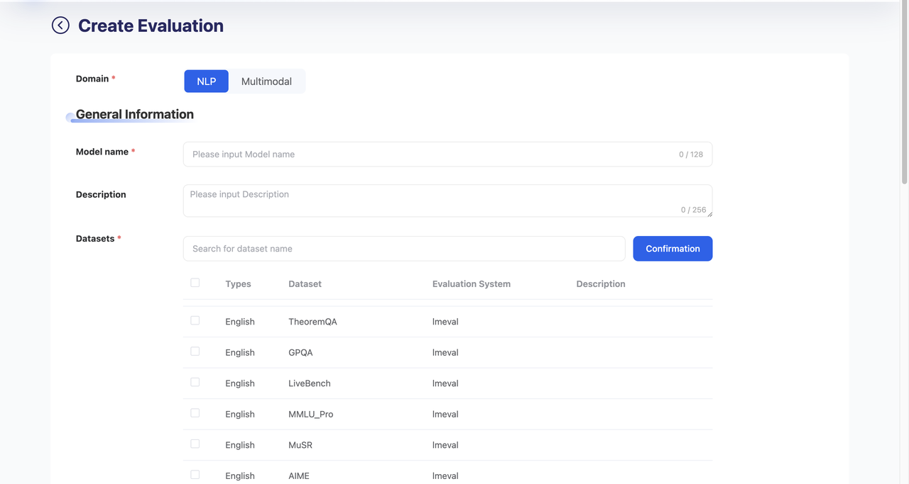
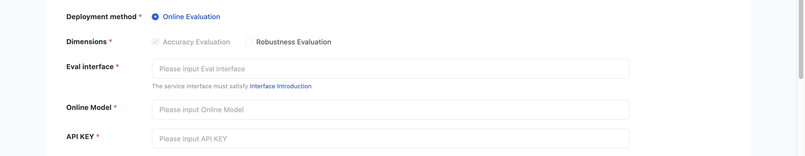
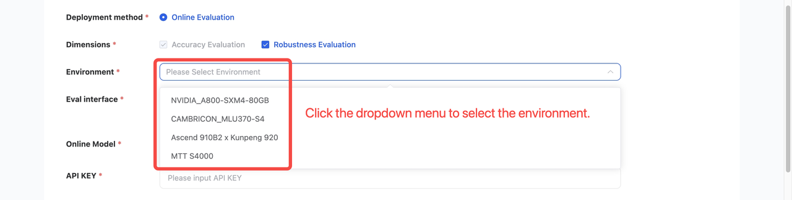
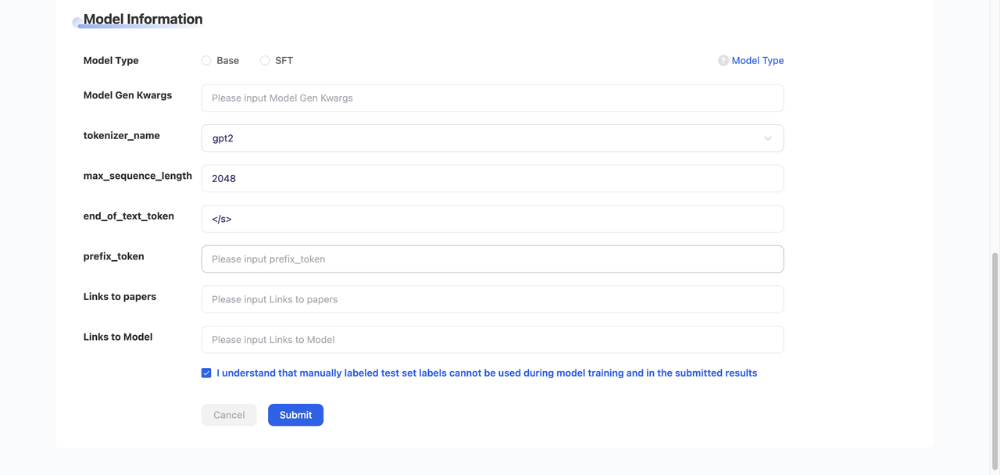
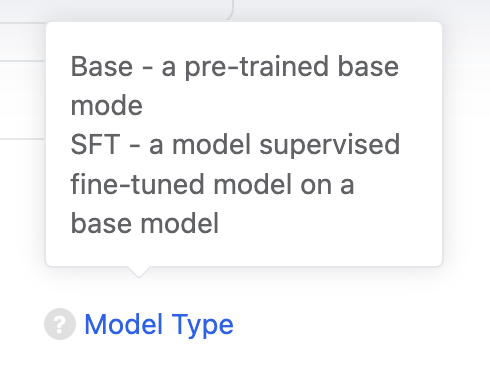
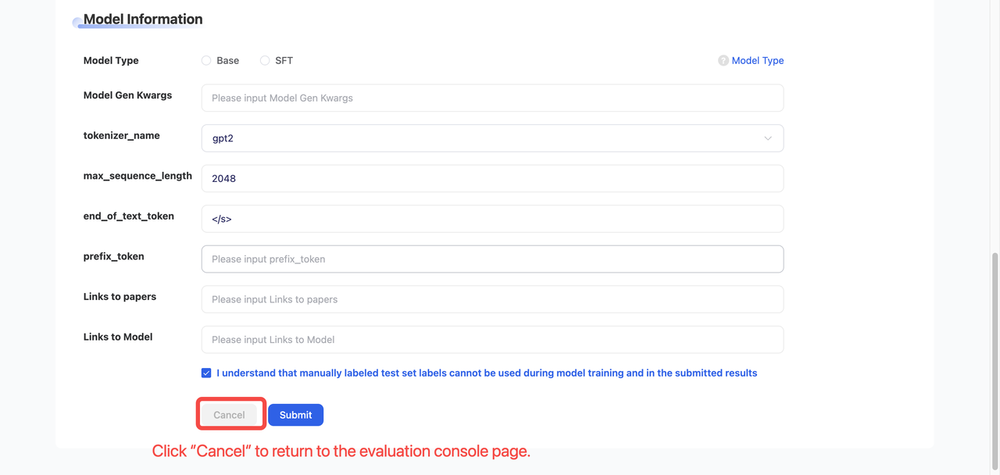
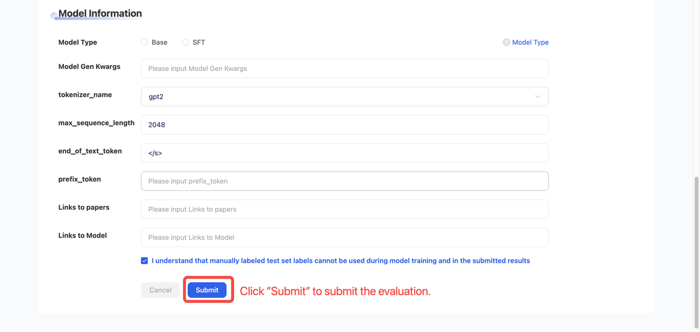
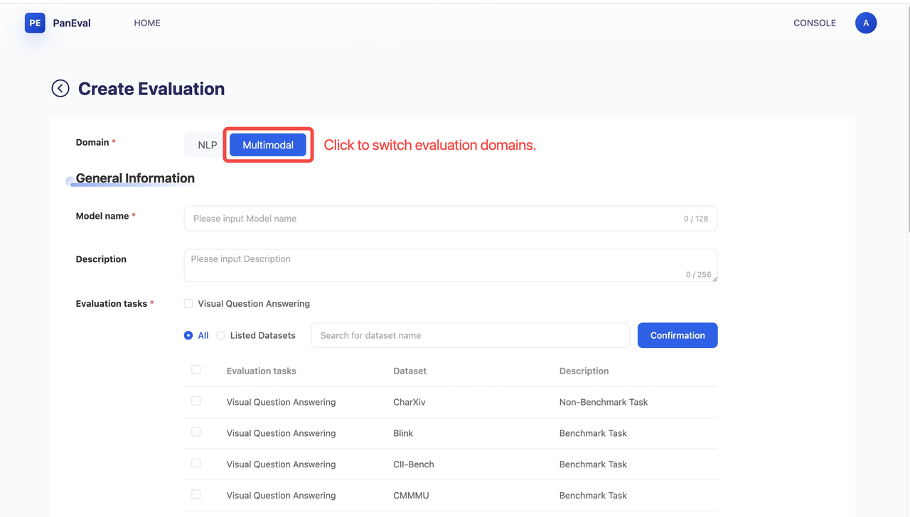
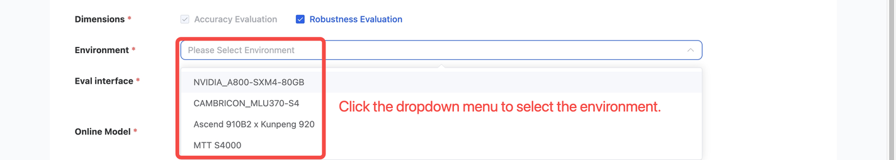

# Evaluation Operation Process

## Natural Language Processing \(NLP\) Evaluation

The evaluation focuses on assessing various capabilities of large language models\. In addition to custom datasets, several underexplored public datasets were selected for mainstream capability categories\.

The platform provides a Natural Language Processing \(NLP\) evaluation module for Large Language Models \(LLMs\)\.

- **Supported task types:** It covers a wide range of NLP scenarios, including but not limited to text classification, reading comprehension, information extraction, machine translation, and dialogue generation\.

- **The evaluation assesses eight core capabilities:** Basic Language Processing, Mathematical Ability, Coding Proficiency, Knowledge Application, Reasoning Ability, Task Solving, Instruction Following, and Safety and Values\.

### Related Parameters

- **Domain**

    - Includes NLP and Multimodal

    - When NLP is selected, it is highlighted by default

**General Information**

**Model Name**

- Enter the model name, up to 128 characters

**Description \(Optional\)**

- Enter a description of the model, up to 256 characters

**Datasets**

- Users can select multiple datasets for evaluation

- Evaluation dataset list [PanEval Phase I Evaluation Dataset List](https://github.com/eclipse-paneval/paneval-platform/blob/ccb94fbb3675613c850e216ba6271594923c0ebc/docs/paneval-phase-i-evaluation-dataset-list.md)

**Deployment Method**

- Only **“Online Evaluation”** is available

- Selected by default and cannot be modified by users

**Dimensions**

- Two options are available: **Accuracy Evaluation** and **Robustness Evaluation**

- **Accuracy Evaluation** is selected by default and cannot be deselected

- **Robustness Evaluation** is optional; if selected, the user must choose an **Environment** parameter

- Environment include:

    - NVIDIA\_A800\-SXM4\-80GB

    - CAMBRICON\_MLU370\-S4

    - Ascend 910B2 x Kunpeng 920

    - MTT S4000

**Eval Interface**

- Enter the evaluation interface endpoint

**Online Model**

- Enter the name of the online model to be evaluated

**API Key**

- Enter the API key for the online model

**Model Information**

- Modal Type

    - **Optional: Base or SFT**

        - Select either **Base** or **SFT**

    - **Model Type**

        - Hover over the **“Model Type”** label on the right to view the description of each model type:

- **Model Gen Kwargs \(Optional\)**

    - Enter model generation parameters

- **tokenizer\_name**

    - Enter the tokenizer name

- **max\_sequence\_length**

    - Enter the maximum sequence length

- **end\_of\_text\_token**

    - Enter the end\-of\-text token

- **prefix\_token \(Optional\)**

    - Enter the prefix token

- **Links to Paper \(Optional\)**

    - Enter the link to the research paper

- **Links to Model \(Optional\)**

    - Enter the link to the model

- **Manual Annotation Test Set Acknowledgement**

    - Below the model link section, the following statement is displayed:
    “I understand that manually labeled test set labels cannot be used during model training and in the submitted results\.”

    - This checkbox is selected by default

    - If the user unchecks it, a red warning message will appear:
    “Please Select ‘I understand that manually labeled test set labels cannot be used during model training and in the submitted results’”

- Cancel/Submit

    - Click **Cancel** to return to the evaluation console page\.

- Click **Submit** to submit the evaluation\.

## Multimodal Evaluation（Multimodal）

Assessing the model's multi\-dimensional performance in tasks such as image\-text classification, image\-text matching, and image\-text generation\.

- **Access Method**: On the **Create Evaluation** page, click **“Multimodal”** in the **Domain** section to switch to the multimodal evaluation domain\.

### Related Parameters

- **Domain \(Evaluation Domain\)**

    - Select **Multimodal**; the Multimodal option will be highlighted when selected

**General Information**

- **Model Name**

    - Enter the model name, up to 128 characters

- **Description \(Optional\)**

    - Enter a model description, up to 256 characters

- **Evaluation Task \(Task \& Dataset Selection\)**

    - Select evaluation tasks and datasets from the PanEval Phase I dataset list[PanEval Phase I Evaluation Dataset List](https://github.com/eclipse-paneval/paneval-platform/blob/ccb94fbb3675613c850e216ba6271594923c0ebc/docs/paneval-phase-i-evaluation-dataset-list.md)

- **Deployment Method**

    - Only **“Online Evaluation”** is supported

    - Selected by default and cannot be modified by users

- **Dimensions**

    - Two evaluation dimensions are available:

        - **Accuracy Evaluation**

        - **Robustness Evaluation**

    - **Accuracy Evaluation** is selected by default and cannot be deselected

    - **Robustness Evaluation** is optional; if selected, users must configure the **Environment** parameter

- **Eval Interface**

    - Enter the evaluation API endpoint

- **Online Model**

    - Enter the name of the online model to be evaluated

- **API Key**

    - Enter the API key for the online model

**Model Information**

- **Model Type**

    - Only the **Direct Inference Model** option is available and selected by default

- **Links to Paper \(Optional\)**

    - Enter the link to the research paper

- **Links to Model \(Optional\)**

    - Enter the link to the model

- **Manual Annotation Test Set Acknowledgement**

    - Below the model link section, the following statement is displayed:
    “I understand that manually labeled test set labels cannot be used during model training and in the submitted results\.”

    - This checkbox is selected by default

    - If the user unchecks it, a red warning message will appear:
    “Please Select ‘I understand that manually labeled test set labels cannot be used during model training and in the submitted results’”

- **Cancel / Submit Buttons**

    - Click **Cancel** to return to the evaluation console page

    - Click **Submit** to submit the evaluation
