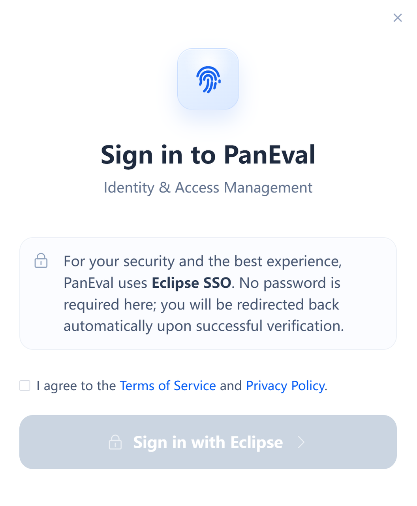
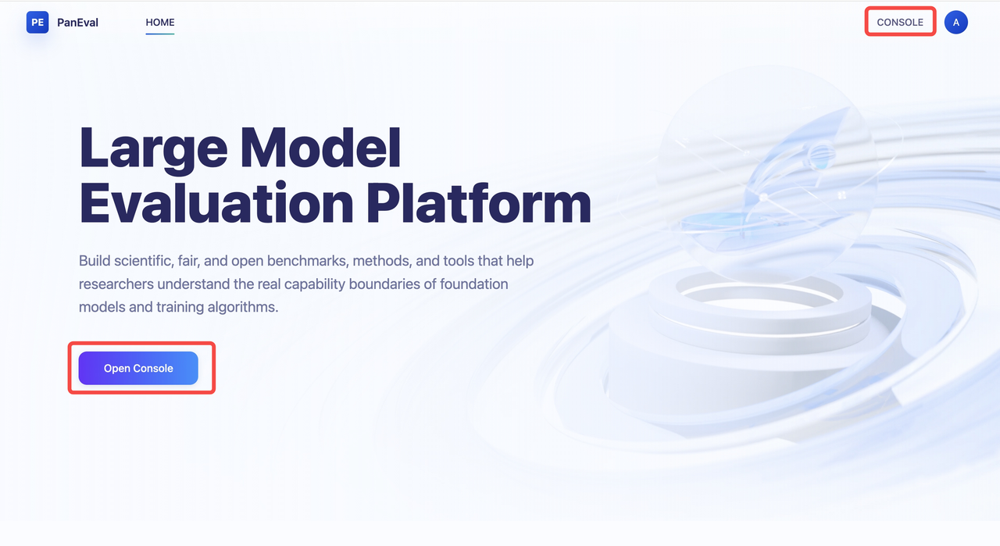
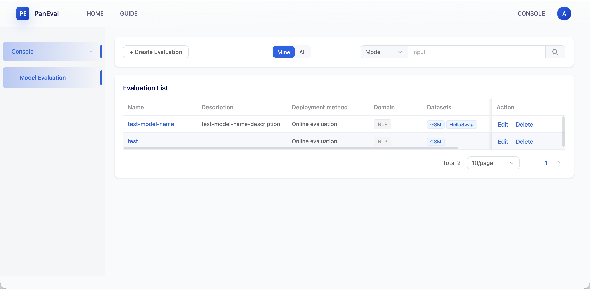
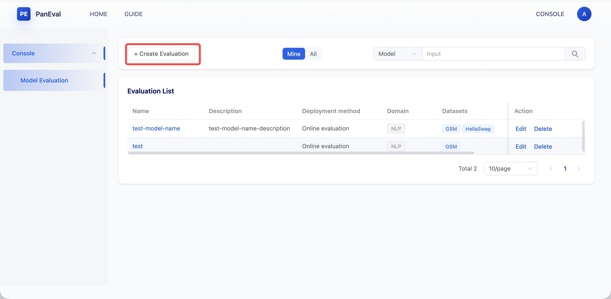
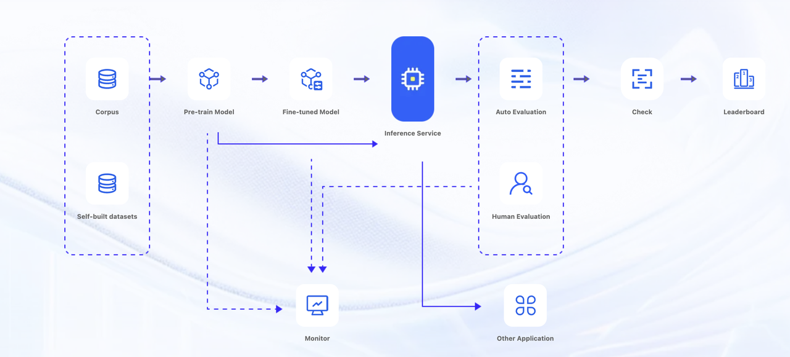

# Quick Start

## Sign In

Click the **Sign in** button to open the **Sign in to PanEval** panel\. Select the agreement checkbox, then click **Sign in with Eclipse** to continue with Eclipse SSO\.

## Enter the evaluation console page

On the Home page of the evaluation system, click **“CONSOLE”** in the top\-right corner or the **“Open Console”** button on the left side to access the evaluation console page\.

## Create an evaluation

Click **Create Evaluation** to enter the evaluation creation page\. The platform mainly supports two core evaluation domains:

- NLP \(selected by default\) 

- Multimodal

**Evaluation Flow**

